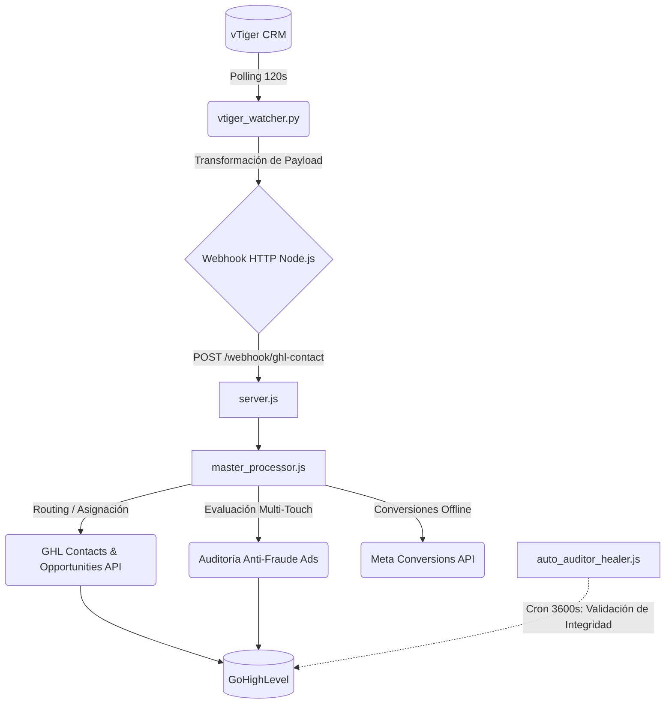

# DOCUMENTACIÓN TÉCNICA: SYSTEM LABORATORIOS NATURALES

Documento de referencia arquitectónica y operativa del sistema de integración y auditoría automatizada entre vTiger CRM y GoHighLevel (GHL).

---

## 1. Arquitectura del Sistema (Flujo de Datos)

El sistema opera bajo una arquitectura de microservicios, donde un proceso en Python actúa como extractor de datos y un servidor Node.js/Express procesa, enriquece y orquesta las peticiones hacia las APIs de GHL y Meta.



---

## 2. Componentes del Sistema

### 2.1 Ecosistema de Extracción (Python: `vtiger_bridge/`)
| Módulo | Descripción Técnica | Ejecución |
| :--- | :--- | :--- |
| `vtiger_watcher.py` | Script de sincronización asíncrona (`asyncio`). Realiza polling a la base de datos de vTiger buscando registros modificados posteriores al timestamp almacenado en `last_sync_state.json`. Formatea el payload y ejecuta un POST request hacia el Maestro Node.js. | Proceso daemon continuo (`npm start`). |
| `exportar_todos_contactos_ghl.py`| Utilidad de respaldo. Extrae lotes masivos de la base de datos completa y los persiste en formato CSV. Optimizado para migraciones manuales sin afectar la cuota de API (Rate Limits). | Ejecución manual (`npm run vtiger:export`). |
- **Columna 1: Precalificado (Sin Teléfono / En Chat)** (Solo Leads Nuevos de Meta sin teléfono)
- **Columna 2: PARA CONTACTAR ahora (Con Teléfono)** (Solo Leads Nuevos de Meta con teléfono)
- **Columna 3: PARA REMARKETING (contactos antiguos)** (Solo contactos de vTiger con $0 de compras)
- **Columna 4: Venta Cerrada (Ganado)** (Solo contactos de vTiger con compras mayores a $0).

### 2.2 Ecosistema de Orquestación (Node.js)
| Módulo | Descripción Técnica | Ejecución |
| :--- | :--- | :--- |
| `server.js` | Servidor Express. Punto de entrada de los webhooks y servidor de estado interno (`http://localhost:3000/health`). | Proceso principal. |
| `master_processor.js` | Motor de reglas de negocio. Procesa el payload entrante, evalúa el historial de conversaciones de Facebook para enrutamiento, analiza duplicados/reingresos y ejecuta solicitudes HTTP hacia GHL para la creación/actualización de Oportunidades. | Por cada webhook (Evento). |
| `auto_auditor_healer.js` | Job en background. Ejecuta consultas paginadas a GHL de forma periódica para auditar la consistencia del pipeline (etapas, etiquetas) corrigiendo desajustes causados por intervención humana. | Cron de 1 hora. |
| `meta_api_service.js` | Cliente HTTP para la Meta Conversions API (CAPI). Envía eventos offline para optimización de exclusiones en campañas publicitarias. | Tras inserción exitosa. |
| `pipeline_manager.js` | Script de inicialización (Idempotente). Verifica y crea estructuras requeridas (Pipelines/Stages) en GHL si estas no existen en el entorno. | On-boot. |

---

## 3. Protocolo de Modificaciones y Desarrollo (Sandbox)

Para preservar la integridad del entorno de producción, las modificaciones al código core (ej. lógica de deduplicación, asignación de asesores) deben seguir un flujo estricto de desarrollo modular:

1. **Extracción y Aislamiento:**
   Solicitar la extracción del módulo/función objetivo hacia un script de pruebas aislado dentro del directorio `scratch/` (Ej: `scratch/test_module.js`).
2. **Pruebas en Entorno Local (Sandbox):**
   Desarrollar y ejecutar pruebas unitarias con mocks o payloads de prueba locales (sin invocar APIs de producción) utilizando el comando `node scratch/test_module.js`.
3. **Despliegue (Plug & Play):**
   Tras la validación técnica exitosa, inyectar y refactorizar el código validado en el módulo original de producción (ej. `master_processor.js`) y reiniciar los servicios.

---

## 4. Referencia de Comandos Operativos

- **Inicialización Concurrente (Daemon):**
  Ejecuta de forma paralela los entornos Node.js y Python.
  ```bash
  npm start
  ```
- **Exportación Masiva (Migración Segura):**
  Generación de archivos CSV omitiendo el procesamiento del webhook.
  ```bash
  npm run vtiger:export
  ```
- **Monitoreo Local:**
  Endpoint de telemetría y métricas operativas de la instancia Node.js.
  - `http://localhost:3000/health`
