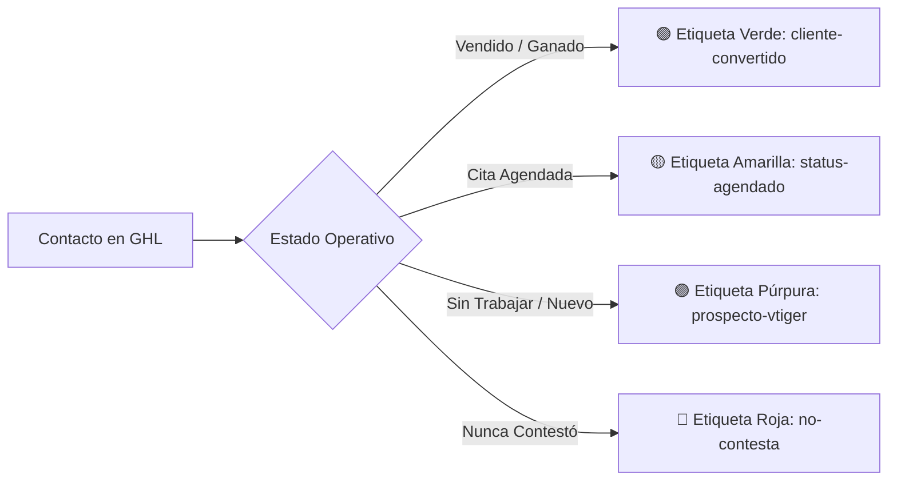

# 🎯 GUÍA MAESTRA: COLA UNIVERSAL CALL CENTER EN GOHIGHLEVEL (GHL)
**Documento Técnico & Operativo para Dirección y Gerencia (Javier Soldevilla & Equipo)**  
*Ecosistema: Laboratorios Naturales BioNatural — Integración Nativa vTiger ➡️ GoHighLevel*

---

## 1. Visión Estratégica del Proyecto
El objetivo central es dotar al equipo de ventas de una **experiencia nativa, ultra rápida y completa dentro de GoHighLevel**, superando las restricciones históricas de vTiger (que limitaba a 15 columnas y ralentizaba la operación).

### Principios Fundamentales:
1. **Nativo en GoHighLevel:** Sin aplicaciones externas ni navegaciones complejas; todo dentro del CRM principal.
2. **Cola de Trabajo en Tabla Plana (No Kanban):** Los asesores operan sobre una tabla ágil, similar a un Excel inteligente, sin el peso visual de las tarjetas.
3. **Visión por Sub-Usuario y Edificio/Oficina:** Cada sede y asesor visualiza su propia cola de trabajo en tiempo real con sus datos específicos.
4. **Búsqueda Dinámica por Similitud:** Capacidad de jalar registros al instante escribiendo cualquier dolencia (*Artritis, Diabetes*), canal (*FB-MSGR*), sede o teléfono.
5. **Ordenamiento Automático por Modificación (`Modified Time`):** Cada lead que se toque o agende asciende inmediatamente a la primera fila.

---

## 2. Superando las Limitaciones de vTiger: Las 20+ Columnas en GHL
Mientras que vTiger limitaba a 15 campos visibles, la arquitectura construida en GoHighLevel permite activar **más de 20 columnas de alta precisión** sin sobrecargar la interfaz:

| # | Columna en GoHighLevel | Campo Origen vTiger | Función para el Vendedor |
|---|---|---|---|
| **1** | **Nombre y Apellidos** | `First Name` + `Last Name` | Identificación personal limpia. |
| **2** | **Teléfono USA** | `Phone` (`+1...`) | Marcación directa normalizada. |
| **3** | **Propietario / Asesor** | `assignedTo` (GHL User) | Responsable actual del lead. |
| **4** | **Status del Contacto** | `vTiger Status del Contacto` | *Vendido, Agendado, Nunca Contestó, Sin Trabajar*. |
| **5** | **Anotaciones Redes** | `vTiger Anotaciones Redes` | Notas clínicas o resumen del chat del cliente. |
| **6** | **Producto / Dolencia** | `vTiger Producto Condicion` | *Artritis, Diabetes, Próstata, Potencia, etc.* |
| **7** | **Canal de Captación** | `vTiger Canal Captacion` | *FB-MSGR, WhatsApp, Web, etc.* |
| **8** | **Campaña Origen** | `vTiger Campana Origen` | Nombre completo de la pauta publicitaria. |
| **9** | **Total Compras** | `vTiger Total Compras` | Historial de transacciones previas (*1, 2, 3...*). |
| **10** | **Monto Última Compra USD**| `vTiger Monto Ultima Compra USD` | Ticket de la última venta en dólares. |
| **11** | **Total Histórico USD** | `vTiger Total Historico Gastado USD`| Valor total de vida del cliente (LTV). |
| **12** | **Fecha Primera Compra** | `vTiger Fecha Primera Compra` | Antigüedad del cliente como comprador. |
| **13** | **Fecha Última Compra** | `vTiger Fecha Ultima Compra` | Días transcurridos para cálculo de recompra. |
| **14** | **¿Tiene Venta? (Estado)** | `vTiger Estado Comercial` | *CONVERTIDO* vs *SIN VENTA*. |
| **15** | **Sede / Tienda Compra** | `vTiger Sede / Tienda Compra` | Ubicación geográfica o tienda de procedencia. |
| **16** | **Última Compra Producto** | `vTiger Última Compra Producto` | Tratamiento específico adquirido. |
| **17** | **ID vTiger / Contact No** | `vTiger ID Cliente` (`12x...`) | Código interno de auditoría para cruce contable. |
| **18** | **Fecha de Creación** | `vTiger Fecha Creacion` | Fecha en la que ingresó el lead originalmente. |
| **19** | **Etiquetas Inteligentes** | `tags` (12 tags) | Badges visuales de año, zona y dolencia. |
| **20** | **Fecha de Modificación** | `Updated At` (Nativo GHL) | Control del orden de trabajo en vivo. |

---

## 3. Diferenciación Visual por Estados (Colores y Badges)
En la captura de vTiger se observa una clara distinción cromática por estado. En GoHighLevel, esto se replica mediante dos mecanismos combinados:

* **Columna Status del Contacto:** Muestra el texto exacto (*VENDIDO, AGENDADO, NUNCA CONTESTO, SIN TRABAJAR*).
* **Etiquetas de Color:** Las Smart Lists de GHL colorean los badges de tags automáticamente, permitiendo al ojo humano del vendedor identificar clientes cerrados (verde) de prospectos fríos en menos de un segundo.

---

## 4. Vistas Inteligentes Segmentadas por Sede / Edificio / Asesor
Cada sub-usuario (asesor) o supervisor de edificio tendrá su propia pestaña filtrada en tiempo real:

### Mapeo de Sub-Cuentas y Vistas por Edificio:
1. **Sede Central Palacios:**
   * *Filtro:* `Propietario = REDES PALACIOS ERNESTO` o `Sede = Palacios`.
   * *Pestaña:* `🏢 CALL CENTER - SEDE PALACIOS`.
2. **Sede Ultra:**
   * *Filtro:* `Propietario = REDES PALACIOS ULTRA` o `Campaña contiene ULTRA`.
   * *Pestaña:* `🏢 CALL CENTER - SEDE ULTRA`.
3. **Sede Benavides (Edificio 1 y 2):**
   * *Filtro:* `Propietario = REDES BENAVIDES 1` / `BENAVIDES 2`.
   * *Pestaña:* `🏢 CALL CENTER - BENAVIDES`.
4. **Sede Roosevelt:**
   * *Filtro:* `Propietario = REDES ROOSVELT BIONATURAL`.
   * *Pestaña:* `🏢 CALL CENTER - ROOSEVELT`.
5. **Sede Piura:**
   * *Filtro:* `Propietario = REDES PIURA BIONATURAL`.
   * *Pestaña:* `🏢 CALL CENTER - PIURA`.

> **Privacidad y Permisos:** Los asesores solo pueden visualizar sus contactos asignados si su rol de usuario tiene configurado `Only Assigned Data`. Los supervisores y Javier Soldevilla tienen la **Vista Global** de todas las sedes.

---

## 5. Procedimiento de Configuración Paso a Paso (Post-Migración)

Una vez que la base de datos termine su inyección completa, la activación de estas vistas se ejecuta en 3 pasos:

### Paso 1: Configurar la Tabla Maestra
1. Entrar a GoHighLevel ➡️ Módulo **Contactos (`Contacts`)**.
2. Hacer clic en el ícono de **Columnas** (esquina superior derecha).
3. Activar las 20 columnas listadas en la sección 2 de esta guía.
4. Hacer clic en la cabecera de la columna **`Updated At`** para ordenar de forma **Descendente** (el último modificado queda en la fila 1).

### Paso 2: Crear las Smart Lists por Sede
1. Aplicar filtro: `Asignado a = [Nombre del Asesor o Equipo]`.
2. Hacer clic en **`Guardar como Lista Inteligente` (`Save as Smart List`)**.
3. Asignar el nombre correspondiente (ej: `🎯 COLA - SEDE PALACIOS`).
4. Seleccionar la opción: **Compartir con todos los usuarios** o con el equipo correspondiente.

### Paso 3: Entregar al Equipo Comercial
* Los asesores no tienen que configurar nada; al iniciar sesión en su computadora, verán la pestaña fijada en la parte superior.
* El buscador superior de la tabla responderá de inmediato a búsquedas por dolencia (*Artritis, Diabetes*), nombre, número telefónico o código vTiger.

---

## 6. Cronograma de Ejecución Aprobado

```mermaid
gantt
    title Cronograma de Despliegue Ecosistema GHL
    dateFormat  HH:mm
    axisFormat %H:%M
    section Fase 1 (Datos)
    Barrido e Inyección de Contactos, Propietarios y 12 Tags :active, f1, 16:30, 4h
    section Fase 2 (Ventas)
    Inyección de Oportunidades al Pipeline Histórico :f2, after f1, 3.5h
    section Fase 3 (Despliegue)
    Configuración de Smart Lists y Vistas por Edificio :f3, after f2, 1h
    Auditoría y Entrega con Javier Soldevilla :f4, after f3, 30m
```

1. **Fase 1 (Actualmente en curso):** Barrido de contactos, inyección de los 16 campos, las 12 etiquetas y el Propietario.
2. **Fase 2:** Migración de las ventas esenciales al Pipeline Histórico (`🗄️ Archivo Histórico vTiger`).
3. **Fase 3:** Activación de las Smart Lists universales y segmentadas por sede/edificio con sus columnas completas.

---
*Documento preparado por el Equipo de Integración de Datos para Laboratorios Naturales.*
