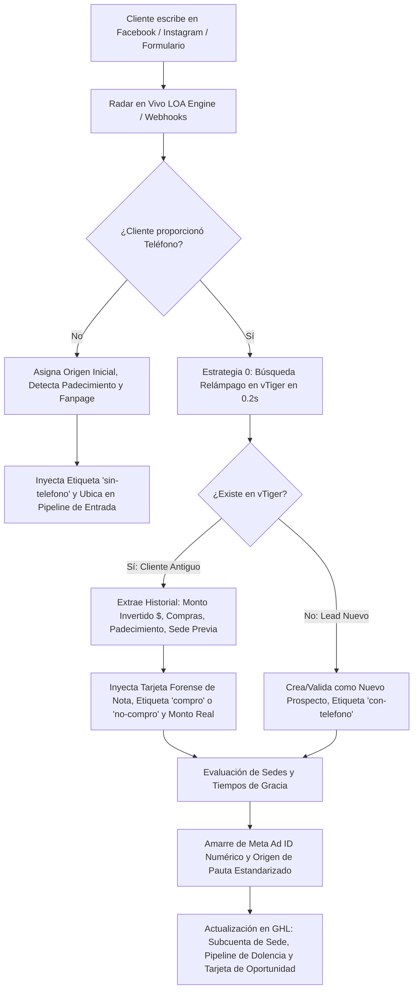

# 🚀 LOA ENGINE: MANUAL MAESTRO DE IDENTIDAD, ARQUITECTURA Y FUNCIONAMIENTO
### *Motor Neuronal de Integración, Enrutamiento y Auditoría Inteligente para Laboratorios Naturales*
**Autor y Arquitecto:** Gabriel Loayza  
**Jurisdicción Operativa:** Estados Unidos (USA) | Dólares ($ USD) | Formato Telefónico NANP (10 Dígitos)  
**Versión:** 2026 (Arquitectura Descentralizada Multi-Tenant, Fail-Safe y Alta Resiliencia)

---

## 1. ¿QUÉ ES LOA ENGINE? (DEFINICIÓN DEL SISTEMA)

**LOA Engine** es el middleware y motor inteligente autónomo diseñado a medida para **Laboratorios Naturales**. Actúa como el **cerebro invisible de operaciones**, interconectando en tiempo real las tres columnas vertebrales del negocio:

1. **Meta Ads & Redes Sociales** (Facebook Messenger, Instagram Direct, Campañas de Formularios, Anuncios de Pauta y Tráfico Orgánico).
2. **GoHighLevel (GHL)** (La trinchera de atención al cliente, chatters, asesores de venta, mensajería SMS/WhatsApp y embudos de seguimiento).
3. **vTiger CRM** (El sistema comercial central, base de datos histórica de clientes, facturación, órdenes de venta *SalesOrder*, registro de compras e inventario).

### ¿Cuál es su misión fundamental?
Eliminar por completo el trabajo operativo manual redundante, blindar la empresa contra el robo o desorden de contactos entre sedes/asesores, auditar la inversión publicitaria y garantizar que cada cliente que escribe sea reconocido, calificado y enriquecido en **0.2 segundos**.

---

## 2. EL PROBLEMA REAL QUE RESUELVE EN EL NEGOCIO

Antes de LOA Engine, la operación de Laboratorios Naturales enfrentaba fricciones operativas críticas:

* **Pérdida de Tiempo Humano:** Los chatters y asesores de redes tenían que salir de GHL, abrir vTiger, buscar si el cliente ya existía, calcular cuántas veces compró y cuánto dinero gastó.
* **Ceguera y Fugas Publicitarias:** No se sabía con precisión matemática qué anuncio (`Meta Ad ID`), qué fanpage y qué proveedor de pauta (`Click2Ring`, `Ernesto` o `In-House`) había traído a cada contacto.
* **Guerra entre Sedes y Canibalización de Leads:** Asesores de distintas sedes (Palacios, Benavides, Piura, etc.) atendían a los mismos clientes, sobreescribían datos o se disputaban comisiones sin reglas claras de exclusividad.
* **Doble Ingreso Inadvertido:** Si un cliente que ya existía volvía a hacer clic meses después en otro anuncio (por ejemplo, para otra dolencia como Artritis o Diabetes), el sistema anterior no generaba alertas forenses de reingreso publicitario.

---

## 3. ¿QUÉ HACE EXACTAMENTE EL SISTEMA? (CAPACIDADES OPERATIVAS)



### 1. Radar en Vivo de Conversaciones (Detección en < 20 Segundos)
* No espera pasivamente a que un asesor edite el contacto.
* Escanea activamente las conversaciones entrantes de Meta. En cuanto un lead dice *"MUESTRA GRATIS"* o envía un primer mensaje, LOA Engine lo intercepta, identifica la fanpage de origen y arranca el procesamiento.

### 2. Estrategia 0: Vinculación Inmediata por Teléfono (0.2s)
* Opera bajo el estándar telefónico de EE.UU. (**NANP de 10 dígitos**, descartando prefijos internacionales `+1`).
* En cuanto el cliente escribe su número en el chat, el motor consulta directamente la base de datos de vTiger (`homephone`, `mobile`, `phone`).
* **En menos de un parpadeo:**
  * Lee el historial de compras (`spl_num_compras`).
  * Lee el valor monetario real gastado en dólares (`cf_3392`).
  * Trae el tratamiento o dolencia histórica (`cf_2610`).
  * Trae la ciudad (`cf_1157`) y estado de EE.UU.

### 3. Atribución Publicitaria Precisa y Blindaje de Meta Ad ID
* **Extracción del ID Numérico Real:** Valida mediante expresiones regulares estrictas que el `Meta Ad ID` sea una cadena numérica legítima de 8 a 25 dígitos (`/^\d{8,25}$/`), purgando cualquier basura de texto.
* **Consulta Graph API en Vivo:** Si el anuncio tiene datos, consulta directamente la API de Meta para extraer el nombre de la campaña, conjunto de anuncios y anuncio.
* **Identificación del Proveedor:** Mapea automáticamente la fuente según la fanpage y la campaña:
  * Si viene de la fanpage Ultra o campaña César ➔ **`CLICK2RING`**
  * Si la campaña o fanpage indica Ernesto ➔ **`ERNESTO`**
  * Si es tráfico orgánico o equipo interno ➔ **`IN_HOUSE`**
* **Nomenclatura Canónica de Origen:**
  `[SEDE]-[PROVEEDOR]-[CANAL]-[TRATAMIENTO]`  
  *(Ejemplo: `PALACIOS-CLICK2RING-FB-MSGR-Potencia` o `BENAVIDES-IN_HOUSE-FORM-Diabetes`)*.

### 4. Detección Inteligente de Reingresos y Tarjetas de Notas Forenses
Cuando un cliente existente vuelve a interactuar por un nuevo anuncio publicitario, LOA Engine:
* Detecta el cambio de Ad ID o el reingreso publicitario.
* Actualiza los UTMs y la fuente del contacto.
* Inyecta una **Tarjeta de Nota Forense Oficial** en el perfil de GHL:
  ```text
  🚨 [SAVE PROCESS: REINGRESO POR NUEVO ANUNCIO / CAMPAÑA DIFERENTE]
  ━━━━━━━━━━━━━━━━━━━━━━━━━━━━━━━━━━━━━━━━
  - Fecha: 26/9/2026, 15:30:00 (EST)
  - Origen/Fuente Asignada: PALACIOS-ERNESTO-FB-MSGR-Artritis
  - Tratamiento Detectado: Artritis
  - Nuevo Ad ID: 120226588408570607
  - Fanpage de Entrada: Naturales BioNatural
  - Campaña Detectada: ARTRITIS - ERNESTO
  - Interacción: DOBLE INGRESO PUBLICITARIO
  - Estado de Pauta: ACTUALIZADO (Ad ID y Origen renovados por nuevo anuncio)
  ----------------------------------------
  Powered by LOA Engine - Gabriel Loayza
  ```

### 5. Arquitectura Descentralizada Multi-Tenant (Aislamiento de Sedes)
* Cada sede física de Laboratorios Naturales (**Palacios**, **Benavides**, **Piura**, etc.) opera como un tentáculo hermético e independiente.
* Cada sede cuenta con:
  * Su propio Location ID y clave privada de API (PIT) de GoHighLevel.
  * Su propia Meta Developer App y cuotas de Graph API independientes.
  * Su propio equipo de chatters, asesores y líneas de WhatsApp/SMS.
* **Cero Fugas entre Sedes:** Un contacto de Benavides jamás caerá accidentalmente en la cuenta de Palacios.

### 6. Motor de Auditoría y Autocuración (Audit Engine - 25+ Reglas de Integridad)
* El sistema corre un motor de validación continua (`audit_engine.js`) que verifica 25 reglas lógicas de negocio:
  * Si el contacto tiene compras en vTiger > 0 ➔ Obliga etiqueta `compro` y purga `no-compro`.
  * Si no tiene compras ➔ Obliga etiqueta `no-compro` y purga `compro`.
  * Si tiene teléfono válido ➔ Obliga etiqueta `con-telefono` y retira `sin-telefono`.
  * Si no tiene teléfono ➔ Bloquea etapas avanzadas del pipeline comercial y lo mantiene en precalificación.
  * Si un humano mueve manualmente una tarjeta a una etapa incorrecta, el curador de fondo detecta la discrepancia y la repara.

### 7. Clasificación por los 6 Padecimientos Oficiales
Mapea el lenguaje natural del cliente y las campañas a las dolencias oficiales de vTiger CRM (`cf_2610`):
1. **`Artritis`** (Dolor articular, reumatismo, inflamación).
2. **`Tetosterona`** (Potencia masculina, vigor, energía, maca/black).
3. **`Diabetes`** (Glucosa, azúcar, control metabólico).
4. **`Hongos`** (Infecciones fúngicas, uñas, piel).
5. **`Gastro`** (Gastritis, reflujo, acidez, digestión).
6. **`Gummies`** (Gomitas vitamínicas, suplementos masticables).

---

## 4. INTEGRACIÓN CON LOS WORKFLOWS DE SEGUIMIENTO (GHL)

LOA Engine actúa como el **alimentador y clasificador** para que GoHighLevel ejecute las automatizaciones sin intervención humana:

* **Workflow 1 (Asignación y Telemetría):** En cuanto LOA Engine inyecta las etiquetas (`con-telefono`, dolencia, origen), GHL asigna la oportunidad al asesor correcto.
* **Workflow 2 (Seguimiento Automático por Goteo de 7 Días):**  
  Diseñado para prospectos fríos o sin respuesta:
  * Disparador manual o por etiqueta (`iniciar-goteo`).
  * Secuencia de 7 días basada en psicología de dolor/pudor para el mercado latino de EE.UU.
  * Función `Stop on Response: ON` (si el cliente responde en cualquier momento, el bot se calla y le pasa el control inmediato al asesor humano).

---

## 5. RESUMEN DE IMPACTO PARA LABORATORIOS NATURALES

| Métrica / Proceso | Sin LOA Engine | Con LOA Engine |
| :--- | :--- | :--- |
| **Tiempo de Calificación de Lead** | 5 a 15 minutos de búsqueda manual | **0.2 segundos** automáticos |
| **Atribución de Publicidad** | Incierta / Datos perdidos | **100% precisa** (Meta Ad ID + Campaña) |
| **Control de Sedes** | Desorden y conflictos entre asesores | **Aislamiento Multi-Tenant** hermético |
| **Actualización de Compras** | Desactualizado / Subjetivo | **Sincronizado con vTiger CRM ($ USD)** |
| **Reingresos Publicitarios** | Invisibles / No detectados | **Tarjetas de Notas Forenses Automáticas** |
| **Calidad de Datos en Pipeline** | Llena de errores humanos | **Autocurada 24/7** por el Audit Engine |

---

*Documento técnico de referencia arquitectónica generado para Laboratorios Naturales y equipos de desarrollo de LOA Engine.*
