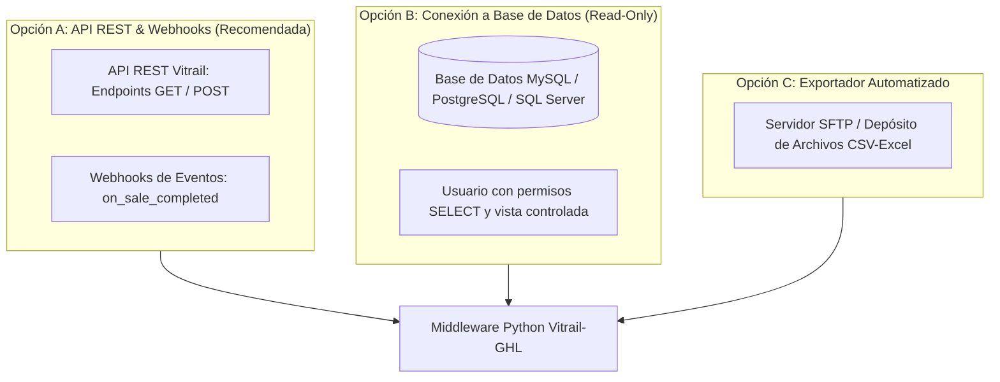

# 📑 Dossier Técnico: Requerimientos de Conectividad y Solicitud de Accesos (Vitrail ↔ GoHighLevel)

**Documento Oficial de Especificación Técnica para la Administración de Sistemas y Directiva de Vitrail**

---

## 🎯 1. Propósito y Alcance del Proyecto

El objetivo de esta integración es interconectar la plataforma operativa y de gestión de **Vitrail** con la suite de CRM y Marketing Automatizado **GoHighLevel (GHL)** mediante un **Middleware Empresarial Autónomo**.

### Objetivos Operativos:
1. **Migración Histórica (2019 – 2026):** Extraer y estructurar la base de datos histórica de clientes, compras previas, montos y fórmulas ópticas para activar campañas de fidelización, control anual y recompra.
2. **Sincronización Bidireccional en Tiempo Real:** 
   * **Vitrail ➡️ GHL:** Reflejar compras y nuevos clientes registrados en Vitrail dentro de GHL en milisegundos.
   * **GHL ➡️ Vitrail:** Notificar a Vitrail cuando los asesores comerciales en el call center concreten citas o cierres de venta.

---

## 🔐 2. Opciones de Conectividad y Accesos Solicitados

Para habilitar el Middleware, se proponen tres métodos de interconexión con Vitrail, priorizados de mayor a menor preferencia:

---

### 🌟 Opción A: Conexión mediante API REST & Webhooks (Óptima)

Solicitud de credenciales y configuración técnica:

1. **Credenciales API de Vitrail:**
   * `API_BASE_URL` (ej. `https://api.vitrail.com/v1` o dominio local de la sede/servidor).
   * `API_KEY` o `Bearer Token` de servicio con alcance:
     * `customers:read` (Lectura de clientes y datos de contacto).
     * `sales:read` (Lectura de historial de compras, montos, sedes y fórmulas).
     * `orders:write` / `customers:write` (Actualización de estados y notas comerciales).

2. **Endpoints Requeridos en Vitrail:**
   * `GET /customers`: Listado paginado con filtros por rango de fecha (`from_date=2019-01-01`).
   * `GET /sales` o `GET /orders`: Listado de ventas históricas por cliente.
   * `POST /external-sync/ghl`: Endpoint receptor para que el Middleware envíe actualizaciones de citas o ventas cerradas por el equipo comercial.

3. **Webhooks Salientes de Vitrail (Event-Driven):**
   * Disparador ante evento `sale_created` o `customer_created` dirigido a:  
     `POST https://servidor-middleware.com/api/v1/vitrail/sale-event`

---

### 🛡️ Opción B: Acceso Directo a Base de Datos (Solo Lectura)

En caso de que Vitrail no disponga de módulo de API REST, se solicita un usuario de base de datos con privilegios controlados:

1. **Tipo de Acceso:** Usuario dedicado de **Solo Lectura (`SELECT`)** sobre las tablas de clientes, ventas y prescripciones.
2. **Tablas o Vistas Solicitadas:**
   * `clientes` (ID, Nombres, Apellidos, Teléfono, Celular, Email, DNI/Identificación, Ciudad).
   * `ventas` / `comprobantes` (ID Venta, ID Cliente, Fecha Emisión, Monto Total, Sede/Tienda, Estado).
   * `detalle_ventas` (Producto, Tipo Lente, Marca, Tratamiento).
   * `recetas_medicas` / `fórmulas` (OD, OI, Adición, Esfera, Cilindro, Eje, Observaciones).
3. **Seguridad:** Conexión cifrada vía SSL/TLS con restricción por IP fija del servidor Middleware.

---

### 📁 Opción C: Exportador Automatizado / Lotes Periódicos

Como alternativa de contingencia:
* Extracción completa en formato **CSV o Excel (`.xlsx`)** con los registros de 2019 a 2026.
* Configuración de un depósito programado en SFTP o carpeta compartida con entregas automáticas diarias.

---

## 📊 3. Diccionario de Datos y Mapeo Técnico

| Parámetro en Vitrail | Tipo de Dato | Equivalente en GoHighLevel | Utilidad Comercial en GHL |
| :--- | :--- | :--- | :--- |
| `id_cliente` / `codigo` | String | `vitrail_id_cliente` | Identificador único de trazabilidad |
| `nombres` / `primer_nombre` | String | `firstName` | Personalización de mensajes SMS/WhatsApp |
| `apellidos` | String | `lastName` | Identificación en fichas de asesor |
| `celular` / `telefono` | String (E.164) | `phone` | Canal directo de recontacto |
| `correo` / `email` | String | `email` | Campañas de fidelización por correo |
| `producto` / `articulo` | String | `vitrail_ultima_compra_producto` | Segmentación (*Multifocales, Antirreflejo, etc.*) |
| `fecha_venta` | Date (YYYY-MM-DD) | `vitrail_fecha_ultima_compra` | Recordatorio de control visual anual (12 meses) |
| `monto_total` | Numeric | `vitrail_monto_ultima_compra` | Clasificación por ticket de compra |
| `total_acumulado` | Numeric | `vitrail_total_historico_gastado` | Detección de clientes VIP / Alto Valor |
| `sede` / `sucursal` | String | `vitrail_sede_compra` & Tag `sede-*` | Asignación automática al asesor de sucursal |
| `receta` / `graduacion` | Text | `vitrail_graduacion_notas` | Historial clínico visible para el call center |

---

## 🔒 4. Protocolos de Seguridad y Buenas Prácticas

1. **Cifrado en Tránsito y Reposo:** Toda comunicación viaja sobre **HTTPS (TLS 1.3)** y las bases de datos intermedias usan almacenamiento cifrado con control de acceso restringido.
2. **Integridad de Datos:** El Middleware no sobrescribe registros contables ni modifica correlativos en Vitrail; opera de forma segura y auditable.
3. **Rate Limiting y Protección del Servidor Vitrail:** Las consultas históricas se ejecutan por lotes segmentados con tiempos de espera (`sleep`) para no impactar el rendimiento operativo del servidor central durante horas de atención.
4. **Registro de Auditoría (Logs):** Registro forense de cada petición con ID de transacción, código de respuesta y timestamp.

---

## 🤝 5. Próximos Pasos para la Habilitación

1. **Revisión y Aprobación:** Validación del presente documento por parte del responsable técnico de Vitrail.
2. **Entrega de Credenciales de Prueba:** Proveer token API o credenciales de entorno sandbox/producción.
3. **Prueba Piloto (Control):** Validación de 10 a 20 registros entre Vitrail y el Middleware.
4. **Despliegue Completo:** Habilitación de la sincronización 24/7.
