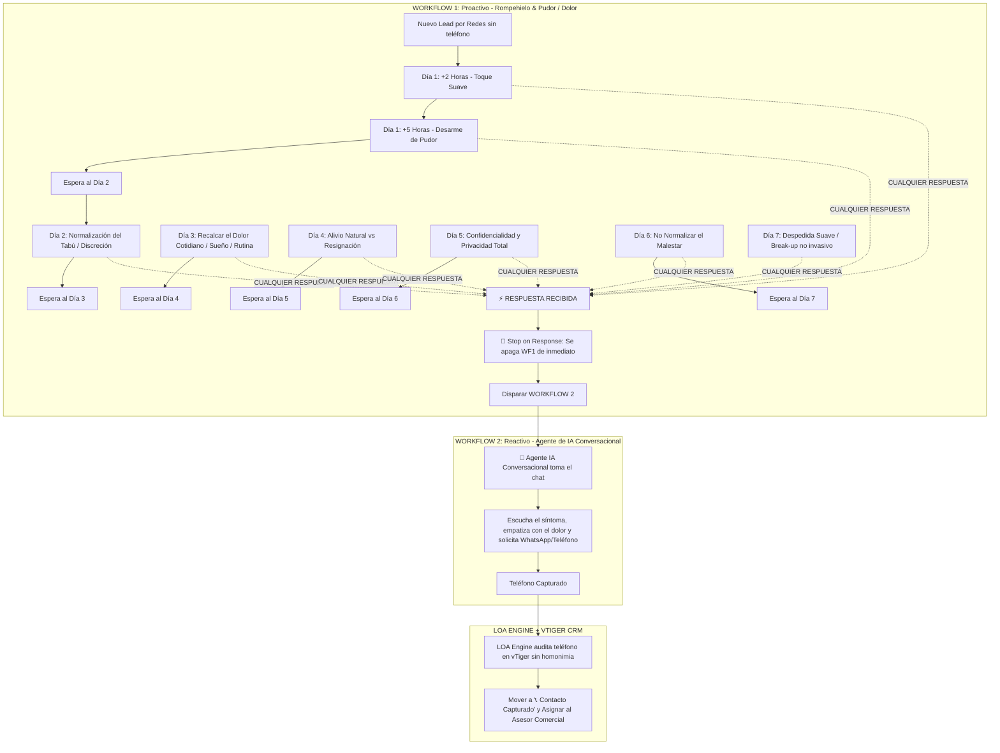

# 💧 Arquitectura Dual: Goteo Proactivo Poco Invasivo (WF1) + Agente IA Reactivo (WF2)
**Proyecto:** LOA Engine - Laboratorios Naturales  
**Enfoque Psicológico:** Reducción del pudor/tabú de salud + Conexión empática con el dolor diario + Seguimiento intradía (Día 1 por horas) y diario (Días 2-7).

---

## 🎯 Dinámica del Sistema

---

# 1️⃣ WORKFLOW 1: Proactivo (Plantillas Generales, Pudor y Dolor)

### 🎯 Principios del Copywriting
1. **Poco Invasivo:** No vendemos de golpe, no exigimos datos bruscamente.
2. **Desarmar el Pudor:** Muchos pacientes sufren en silencio (problemas íntimos, próstata, debilidad, glucosa, dolores crónicos) y les da vergüenza consultar. Normalizamos su situación con delicadeza.
3. **Recalcar el Dolor:** Conectar con cómo ese malestar le arruina el descanso, el día a día o la convivencia familiar.
4. **Misión Única:** **LOGRAR CUALQUIER RESPUESTA** (un *"sí"*, *"hola"*, *"sigo con dolor"*, un sticker). La primera respuesta apaga el WF1 y activa el WF2.

---

### ⚙️ Configuración en GHL (Settings)
* **Nombre:** `[WF1] Proactivo - Goteo Suave (Pudor y Dolor)`
* **Allow Re-entry:** `NO`.
* **Stop on Response:** `YES` ✅ *(Indispensable: al responder, este flujo se apaga en seco).*
* **Time Window (Ventana de Envío):**
  * **Lunes a Viernes:** `07:00 AM a 10:00 PM`
  * **Sábados y Domingos:** `10:00 AM a 04:00 PM`

---

### ⏱️ DÍA 1: Seguimiento por Horas (Lead Caliente e Intradía)

#### 🔹 Toque 1.1 (A las 2 horas de su consulta)
* **Condición:** `Wait: 2 hours`
* **Enfoque:** Ruptura de hielo suave y disponibilidad sin presión.
* **Mensaje:**
> "Hola {{contact.first_name}}, un gusto saludarte. Vi que nos escribiste hace un momento. Solo quería saber si aún estás por aquí o si se te complicó ver la información."

#### 🔹 Toque 1.2 (A las 5 horas de su consulta)
* **Condición:** `Wait: 3 hours` *(5 horas acumuladas del ingreso)*
* **Enfoque:** Validar el síntoma y romper el pudor inicial.
* **Mensaje:**
> "{{contact.first_name}}, sé que a veces por las prisas del día o por pena es difícil hablar de lo que uno siente con la salud. Aquí estamos en total confianza. ¿Sigues sintiendo esa molestia?"

---

### 📅 DÍAS 2 AL 7: Goteo Diario (Recalcar Dolor + Privacidad)

#### 🔹 DÍA 2: Normalización del Tabú y Desarme de Pena (+24 horas)
* **Condición:** `Wait: 24 hours`
* **Enfoque:** Muchos esperan demasiado tiempo por pudor. Normalizar que es muy común.
* **Mensaje:**
> "Hola {{contact.first_name}}, buen día. Muchos de los pacientes que nos consultan nos dicen que tardaron meses en buscar ayuda solo por pena o por pensar que el malestar pasaría solo. Lo que sientes es mucho más común de lo que imaginas y tiene solución natural. ¿Es algo que te viene pasando desde hace tiempo?"

#### 🔹 DÍA 3: Conexión con el Dolor Cotidiano (+24 horas)
* **Condición:** `Wait: 24 hours`
* **Enfoque:** Cómo afecta el descanso, la energía y la tranquilidad del día.
* **Mensaje:**
> "Hola {{contact.first_name}}, no hay nada más desgastante que pasar los días con molestias constantes o no poder descansar bien por las noches por ese malestar. Nadie merece vivir con esa incomodidad. ¿Cómo te has sentido hoy?"

#### 🔹 DÍA 4: Alivio Natural vs Resignación (+24 horas)
* **Condición:** `Wait: 24 hours`
* **Enfoque:** No resignarse a que el dolor o problema es "por la edad".
* **Mensaje:**
> "{{contact.first_name}}, a veces nos acostumbramos a aguantar el dolor o los síntomas pensando que ya es normal, pero tu cuerpo solo te está pidiendo apoyo. Nuestras fórmulas naturales están diseñadas para devolverte tu tranquilidad. ¿Te gustaría saber cómo te pueden ayudar?"

#### 🔹 DÍA 5: Confidencialidad y Privacidad Total (+24 horas)
* **Condición:** `Wait: 24 hours`
* **Enfoque:** Seguridad psicológica. La conversación es 100% privada y discreta.
* **Mensaje:**
> "Hola {{contact.first_name}}, quiero recordarte que cualquier consulta que hagas con nosotros es completamente privada, confidencial y sin ningún compromiso. Tu salud y tu privacidad son lo primero para nosotros. ¿Deseas que te orientemos?"

#### 🔹 DÍA 6: El Costo de Dejar Pasar el Tiempo (+24 horas)
* **Condición:** `Wait: 24 hours`
* **Enfoque:** Recordar suavemente que los problemas de salud no se resuelven solos.
* **Mensaje:**
> "{{contact.first_name}}, cuando dejamos pasar las molestias, el cuerpo suele pasarnos factura más adelante. Atender tu salud a tiempo te ahorra muchas preocupaciones. Si aún sientes ese malestar, cuenta con nosotros para apoyarte. ¿Cómo va tu día?"

#### 🔹 DÍA 7: Despedida Suave / Break-Up No Invasivo (+24 horas)
* **Condición:** `Wait: 24 hours`
* **Enfoque:** Retirada con respeto y elegancia. Cero agobio.
* **Mensaje:**
> "Hola {{contact.first_name}}, no queremos ser inoportunos ni molestarte si este no es el momento adecuado. Cerraremos tu consulta por aquí para darte tu espacio. Si más adelante decides atender tu bienestar, siempre serás bienvenido(a). Solo responde este mensaje cuando lo necesites. ¡Te deseamos mucha salud!"

#### 🔹 Cierre Administrativo (+24 horas del Día 7 sin respuesta)
* **Acciones:**
  * **Update Opportunity:** Mover a `❌ Perdido / Sin Respuesta`
  * **Add Tag:** `sin-respuesta-7d`

---

# 2️⃣ WORKFLOW 2: Reactivo (Agente de IA Conversacional)

### 🎯 Misión
En el segundo exacto en que el lead responde a **cualquiera de los toques anteriores**:
1. El WF1 se apaga solo (`Stop on Response`).
2. El WF2 se enciende por el evento `Customer Replied`.
3. El **Agente de IA Conversacional** toma el control del chat.

### ⚙️ Configuración en GHL
* **Trigger:** `Customer Replied` (Canal: FB Messenger o Instagram DM).
* **Filtros:** `Contact Details > Phone is Empty` + `Tags does not include: atencion-humana-requerida`.
* **Directriz del Agente IA:**
  * Responder con empatía profunda al mensaje del lead (máximo 2 a 3 oraciones).
  * Validar su dolor o preocupación de salud sin tecnicismos fríos.
  * Guiar la conversación hacia la obtención de su número:  
    *Ejemplo de cierre de la IA:*  
    *"Te entiendo perfectamente, {{contact.first_name}}. Es una molestia que afecta mucho la calidad de vida. Para que nuestro especialista te comparta la orientación exacta y la guía de dosificación natural, **¿a qué número de WhatsApp con código de área te la enviamos?**"*

---

# 3️⃣ Sincronización con LOA Engine
Cuando la IA de WF2 logra que el lead comparta su teléfono:
1. El teléfono se guarda en el contacto.
2. Se inyecta la etiqueta `contacto-capturado`.
3. **LOA Engine:**
   - Detecta el teléfono (`>= 7 dígitos`).
   - Hace la verificación forense en **vTiger** sin riesgo de homónimos.
   - Sincroniza su historial de compras reales y mueve la tarjeta a `📞 Contacto Capturado` (o `📞 Lead Calificado`), asignándola al asesor comercial del Call Center para el cierre definitivo de la venta.
