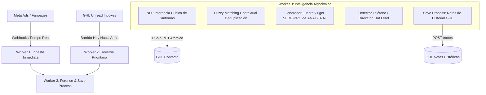

# Contexto Técnico: Arquitectura del LOA Engine (3 Workers Concurrentes + Algorítmica Inteligente)

Este documento define la arquitectura oficial y las directrices operativas del LOA Engine para Laboratorios Naturales, estructurado en **3 Workers Concurrentes** orientados a optimizar la experiencia de los asesores de redes en GoHighLevel (Chats, Contactos y Notas), sin dependencia de Pipelines/Oportunidades.

---

## 🌍 Arquitectura Macro (Reglas de Oro Inquebrantables)

1. **GoHighLevel (GHL)** es el centro neurálgico de Comunicaciones, Chat y Ventas.
2. **vTiger** es únicamente repositorio de logística y compras históricas. **No origina leads ni desvía la conversación.**
3. **Cero Dependencia de Pipelines:** Los asesores de redes trabajan exclusivamente en **Conversaciones (Chats), Contactos y Notas**. El motor NO realiza llamadas a la API para crear o mover etapas de pipelines.
4. **Regla de Asignación Comercial Inmediata:** La asignación comercial (`assignedTo`) pertenece **estricta y únicamente a la Fanpage del mensaje más reciente recibido hoy**. Los antecedentes de vTiger jamás mudan al lead a una sede antigua; únicamente se inyectan en campos personalizados y notas para que el asesor actual conozca al prospecto.
5. **Freshness First (Anti-Tatuado de Datos):** La atribución publicitaria (Ad ID, Campaña, UTMs) se extrae del mensaje o atribución más reciente (`isLast: true`), evitando que datos antiguos queden "tatuados" en el contacto.
6. **Rate-Limit Shield:** Todas las operaciones respetan una cadencia protegida de ~3 req/seg (pausa de 300ms entre contactos), previniendo errores HTTP 429 en la API de GHL (límite: 10 req/seg).

---

## 🤖 Arquitectura de 3 Workers Concurrentes



### 1. Worker 1 (Tiempo Real - Ingesta Inmediata)
- **Misión:** Capturar y procesar instantáneamente los leads que entran hoy.
- **Entradas:** 
  - Webhooks de Meta (`/webhook/meta`)
  - Webhooks de GHL (`/webhook/ghl-contact`, `/webhook/chat-router`)
  - Fast Express Poller (cada 8-15s para contactos con actividad en los últimos 30 min).
- **Comportamiento:** Interrumpible; si entra un nuevo lead mientras se realizan otras tareas, se prioriza inmediatamente su asignación y enriquecimiento.

### 2. Worker 2 (Reversa Prioritaria - Barrido de Bandejas)
- **Misión:** Auditar y reasignar las bandejas vivas de los 6 asesores comerciales trabajando de **hoy hacia atrás** (orden cronológico inverso).
- **Objetivo Primario:** Depurar los ~1,133 chats no leídos (`status=unread`) para que ningún asesor vea leads que pertenecen a otra sede.
- **Cadencia:** 300ms entre contactos con verificación en tiempo real de chats restantes.

### 3. Worker 3 (Forense & Save Process - Inteligencia Algorítmica)
- **Misión:** Enriquecer cada contacto con el stack de datos técnico completo en una sola transacción atómica:
  - **Inferencia Clínica NLP:** Analiza el texto de los mensajes entrantes para clasificar la condición médica (`Artritis`, `Diabetes`, `Próstata`, `Colágeno`, `Potencia`, `Visión`, `Gastro`) y genera etiquetas especializadas (`producto-artritis`, etc.).
  - **Detección de Datos de Envío (Estricto USA):** Extrae exclusivamente teléfonos de Estados Unidos (+1, 10 dígitos válidos con código de área NANP) y direcciones físicas estadounidenses (Street, Ave, Blvd, Apt/Suite, ZIP Code de 5 dígitos, Estados US). Se descarta y filtra cualquier dato o mención foránea fuera de EE.UU. Inyecta la etiqueta `🔥-lead-caliente` ante datos de contacto válidos.
  - **Deduplicación Fuzzy Matching (Estricto USA):** Algoritmo fonético/Levenshtein (umbral >= 0.90) con cotejo de teléfonos estadounidenses de 10 dígitos y validación cruzada por ciudad/estado estadounidense y condición médica.
  - **Fuente de Contacto Estilo vTiger:** Configura el campo nativo `contact.source` con la nomenclatura estandarizada:
    `[SEDE]-[PROVEEDOR]-[CANAL]-[TRATAMIENTO]`
    *(Ejemplo: `PALACIOS-IN_HOUSE-FB-MSGR-Artritis` o `BENAVIDES_1-CLICK2RING-FB-MSGR-Diabetes`)*.
  - **Save Process en Notas:** Ante cualquier cambio de Ad ID, reingreso publicitario o detección de duplicados (`duplicateCount > 1`), inyecta una nota formal en el historial de GHL (`/contacts/{id}/notes`):
    ```text
    📌 [SAVE PROCESS: HISTORIAL DE REINGRESO PUBLICITARIO]
    • Fecha: 04/09/2026 10:45:00 (EST)
    • Nuevo Ad ID: 12021584930281
    • Anuncio / Campaña Previa: 12020948301928
    • Fanpage de Entrada: Redes Benavides 1
    • Campaña Detectada: Campaña Artritis Septiembre
    • Interacción: Clic #2
    ```

---

## 📋 Mapeo de Custom Fields Oficiales de GHL

| Campo Técnico | Custom Field ID | Propósito |
| :--- | :--- | :--- |
| **ID de Anuncio** | `6w3yMjLgIw6npUKWIosr` | ID numérico del anuncio de Facebook (Meta Ads) |
| **Ad ID Alternativo** | `ujLG5Ogp94WfynVubapT` | Campo secundario para compatibilidad |
| **Tratamiento** | `WcrrCIL4A2203kIbeFsJ` | Patología médica inferida por NLP o campaña |
| **vTiger Notas / Graduación** | `cZu95uKBqVydDEh24enl` | Ficha clínica e historial migrado desde vTiger |
| **UTM Source** | `L3eEulpe8II7q0UAJnKZ` | Fuente de tráfico (`facebook` / `Social media`) |
| **UTM Medium** | `HVjiEMKYR2feXviAZ2Jd` | Medio (`cpc` / `messenger` / `facebook`) |
| **UTM Campaign** | `KS3iYmIjVcmFJV7MIDnT` | Nombre de la campaña publicitaria de Meta |

---

## 🛡️ Regla Anti-Vivazos (Cooldown 24 Horas)
Si un prospecto contacta a la Fanpage A (ej. Palacios Ernesto) y dentro de las siguientes 24 horas contacta a la Fanpage B (ej. Benavides 1), el motor bloquea la reasignación para evitar que el cliente rebote entre oficinas y mantenga una atención consistente con el primer asesor. Pasadas las 24 horas, la nueva fanpage toma control pleno.
