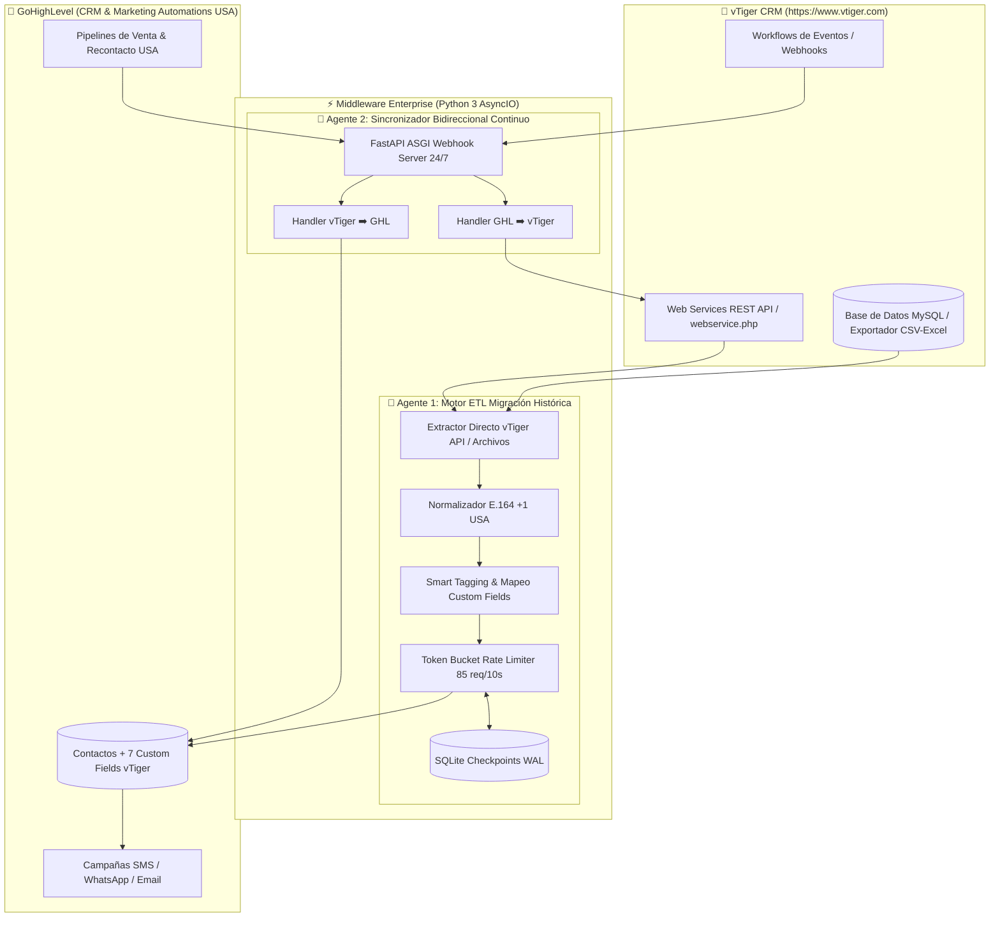

# 🚀 vTiger CRM ↔ GoHighLevel (GHL) Enterprise Integration Suite

Sistema de integración de nivel empresarial desarrollado en **Python 3 (AsyncIO, Pydantic, FastAPI, Pandas, SQLite y Rich)** para la **Migración Histórica Masiva (2019-2026)** y la **Sincronización Bidireccional Continua en Tiempo Real** entre **vTiger CRM (https://www.vtiger.com)** y **GoHighLevel (GHL)** para el mercado de **Estados Unidos (+1)**.

---

## 🏛️ Arquitectura del Sistema: Doble Agente Autónomo



---

## 🌟 Características Principales

1. **🤖 Agente 1: Extractor Nativo de vTiger CRM & Migración Histórica (2019-2026)**
   * **Conexión Nativa API vTiger:** Se conecta directamente a `webservice.php` mediante el protocolo challenge-token y `AccessKey`.
   * **Consulta SQL Automatizada:** Ejecuta queries paginados (`SELECT * FROM Contacts`, `SELECT * FROM Invoice/SalesOrder`) desde 2019 hasta 2026.
   * **Normalización E.164 para USA:** Limpieza matemática de teléfonos estadounidenses (`+1XXXXXXXXXX` de 10 dígitos: Florida, California, Texas, Nueva York, etc.).
   * **Aprovisionamiento Automático de Custom Fields en GHL:** Crea y valida los 7 campos de vTiger en GoHighLevel con un solo comando.
   * **Smart Tagging Dinámico:** Etiquetado por año (`vtiger-2023`), tienda (`sede-miami-store`), producto (`compra-multifocales`) y recompra (`recompra-potencial-anual`).
   * **Checkpoints en SQLite (WAL Mode):** Garantía de cero duplicados; permite pausar y reanudar la migración en cualquier instante.

2. **🔄 Agente 2: Sincronizador Bidireccional en Tiempo Real**
   * **Servidor FastAPI 24/7:** Swagger interactivo en `http://localhost:8000/docs`.
   * **vTiger ➡️ GHL:** Cada nueva venta registrada en vTiger actualiza inmediatamente el contacto en GHL.
   * **GHL ➡️ vTiger:** Notifica a vTiger ante cierres de ventas o citas agendadas por el call center.

---

## 📋 Diccionario de Campos Personalizados en GoHighLevel

| Campo en GHL | Tipo de Dato | Descripción / Ejemplo |
| :--- | :--- | :--- |
| `vtiger_id_cliente` | Single Line Text | ID único del registro en vTiger (Ej: `12x104`) |
| `vtiger_ultima_compra_producto` | Single Line Text | Ej: *Progressive Digital Lenses + Crizal* |
| `vtiger_fecha_ultima_compra` | Date (YYYY-MM-DD) | Fecha exacta de la compra |
| `vtiger_monto_ultima_compra` | Monetary (USD) | Valor monetario en USD de la última compra |
| `vtiger_total_historico_gastado` | Monetary (USD) | Acumulado histórico del cliente (LTV) |
| `vtiger_sede_compra` | Text | Tienda o sucursal (*Miami Store, Houston Store, etc.*) |
| `vtiger_graduacion_notas` | Large Text | Receta médica, fórmula o notas clínicas |

---

## 🚀 Guía de Configuración Rápida

### 1. Variables de Entorno (`.env`)
```env
# GoHighLevel
GHL_API_KEY=tu_token_api_de_ghl
GHL_LOCATION_ID=tu_location_id_de_ghl

# vTiger CRM (https://www.vtiger.com)
VTIGER_URL=https://tuempresa.od2.vtiger.com
VTIGER_USERNAME=admin
VTIGER_ACCESS_KEY=tu_access_key_de_vtiger
```

### 2. Iniciar el Panel Interactivo
Ejecuta [`ejecutar_suite.bat`](file:///C:/Users/Lenovo/.gemini/antigravity-ide/scratch/vitrail-ghl-integration/ejecutar_suite.bat) o:
```bash
python run.py
```
Selecciona la opción **`[4]`** para extraer y migrar directamente desde la API en vivo de vTiger CRM.
